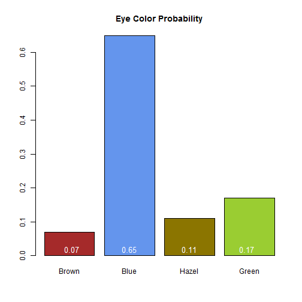

Presentation for Shiny App Eye Color Predictor
========================================================
author: Jason Wilkinson
date: Thu Sep 18 23:53:43 2014


Shiny App Context
========================================================
type: section
transition: rotate
transition-speed: slow

This presentation is for the Shiny App Eye Color Predictor
which can be found at:

https://wilkinsonj.shinyapps.io/Hair_Eye_Sex_ap/

The Data:

<small>The data used in this app is from the HairEyeColor dataset in R.
It contains the information for hair color, eye color,
and sex crosstabulated for 592 statistic students at the 
University of Delaware reported by Snee (1974).</small>

The Data (HairEyeColor)
========================================================
transition: rotate
transition-speed: slow


```
, , Sex = Male

       Eye
Hair    Brown Blue Hazel Green
  Black    32   11    10     3
  Brown    53   50    25    15
  Red      10   10     7     7
  Blond     3   30     5     8

, , Sex = Female

       Eye
Hair    Brown Blue Hazel Green
  Black    36    9     5     2
  Brown    66   34    29    14
  Red      16    7     7     7
  Blond     4   64     5     8
```

Why This App is Useful
===
type: subsection
transition: rotate
incremental: true

<small>
-  It is understood that while the data may not be extendable universally across the globe to
   the population of today, it is a sufficiently large dataset as to give the user a general idea of the
   most likely eye color given a person's hair color and sex.
   
-  This app presents a quick reference for gleaning knowledge.

-  Further app expansions will help couples predict possible hair and eye color combinations
   for their children by including dominant, recessive trait information.
   
</small>


Algorithm, Output
========================================================
type: subsection
transition: rotate
transition-speed: slow

<small>The app filters the dataset by selected hair color and sex. The most likely eye color
corresponds to the maximum of that which is left. The app then shows the probability of that
corresponding eye color and reveals a plot for all of the probabilities. A sample of the output
plot for Male, Blond:</small>

 

